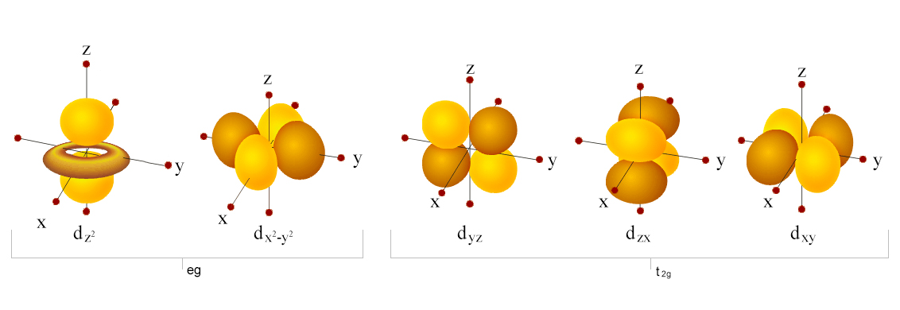
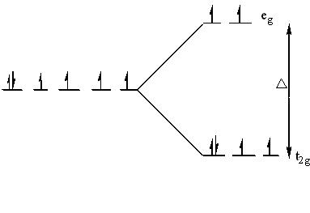
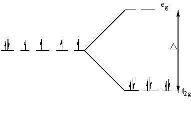
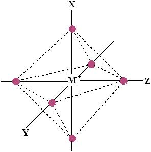
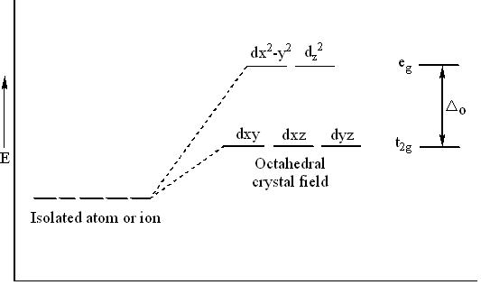
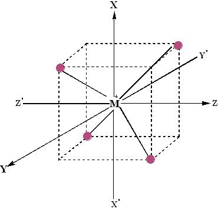
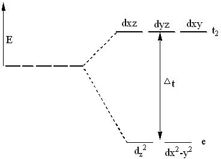
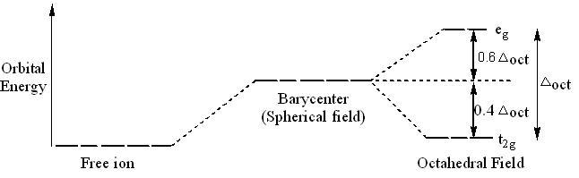

## Theory 

CFT was proposed by the physicist Hans Bethe in 1929. Subsequent modifications were proposed by J. H. Van Vleck in 1935 to allow for some  covalency in the interactions.

Crystal Field Theory was developed to describe important properties of complexes (magnetism, absorption spectra, oxidation states, coordination,). The basis of the model is the interaction of d-orbitals of a central atom with ligands, which are considered as point charges. According to CFT, the attraction between the central metal and ligands in a complex is purely electrostatic.

 

The theory is developed by considering energy changes of the five degenerate d- orbitals being surrounded by an array of point charges consisting of the ligands. As a ligand approaches the metal ion, the electrons from the ligand will be closer to some of the d-orbitals and farther away from others, causing a loss of degeneracy. The electrons in the d-orbitals and those in the ligand repel each other due to repulsion between like charges. Thus, the d-electrons closer to the ligands will have a higher energy than those further away, which results in the d-orbitals splitting in energy.

This splitting is affected by the following factors:

 

- The nature of the ligands. The stronger the ligand, the greater is the splitting.
- Oxidation state of the central metal ion. A higher oxidation state leads to larger splitting.
- Size of d orbitals (i.e., transition series).
- Geometry of the complex.

<h2>Orbital Splitting:</h2>

  The five d-orbitals are given the symbols <em>dxy</em>, <em>dzx</em>, 
  <em>dyz</em>, <em>dx2−y2</em>, and 
  <em>dz2</em>. In a complex they are all differently aligned relative to the incoming charge. 
  Depending on the geometry of the complex, some of the d-orbitals will point directly towards the ligands, while some 
  will point between them. Those which point at the ligands will experience more repulsion between their own electrons 
  and those of the incoming ligands, than will those which do not point directly at them.

  Thus, the orbitals pointing at the ligands will be less stable and higher in energy. Now all the d-orbitals are no 
  longer equivalent, giving rise to the phenomenon of <strong>orbital splitting</strong>, and the difference in energy 
  between the more and less repelled orbitals is called the <strong>crystal field splitting parameter</strong>.

Angular dependence functions of d-orbitals

The electrons can go into either a high spin or low spin arrangement depending on the magnitude of the crystal field splitting energy.

High spin

Low spin

<h2>The Spectrochemical Series:</h2>

  The variation of the magnitude of the crystal field splitting (Δ) with the nature of the ligand follows a regular order, 
  known as the <strong>spectrochemical series</strong>. This series is given below in the order in which ligands produce 
  increasing values of Δ.

  <em>I− &lt; Br− &lt; S22− &lt; SCN− &lt; N3− &lt; 
  F− &lt; urea, OH− &lt; ox, O2− &lt; H2O &lt; NCS− &lt; py, NH3 
  &lt; en &lt; bipy, phen &lt; NO2− &lt; CH3−, C6H5− 
  &lt; CN−</em>

<ul>
  <li><strong>Weak field ligands</strong> have small Δ and will form <em>high spin complexes</em>.</li>
  <li><strong>Strong field ligands</strong> have large Δ and will form <em>low spin complexes</em>.</li>
</ul>

<h2>Octahedral Complexes:</h2>

  The octahedral arrangement of six ligands surrounding the central metal ion is as shown in the figure.

  In an <strong>octahedral complex</strong>, the metal ion is at the centre and the ligands are at the six corners. 
  In the figure, the directions <em>x</em>, <em>y</em>, and <em>z</em> point to the three adjacent corners of the 
  octahedron. The lobes of the <em>eg</em> orbitals (<em>dx²−y²</em> and 
  <em>dz²</em>) point along the <em>x</em>, <em>y</em>, and <em>z</em> axes, while the lobes of the 
  <em>t2g</em> orbitals (<em>dxy</em>, <em>dzx</em>, and <em>dyz</em>) 
  point in between the axes.

  As a result, the approach of six ligands along the <em>+x</em>, <em>+y</em>, <em>+z</em>, <em>−x</em>, <em>−y</em>, 
  and <em>−z</em> directions will increase the energy of the <em>dx²−y²</em> and 
  <em>dz²</em> orbitals (which point towards the ligands) much more than it increases the energy of 
  <em>dxy</em>, <em>dzx</em>, and <em>dyz</em> orbitals (which point in between 
  the metal–ligand bond axes).

  Thus, under the influence of an octahedral field, the <em>d</em> orbitals split into a triply degenerate set of orbitals 
  with lower energy (<em>t2g</em>) and a doubly degenerate set with higher energy 
  (<em>eg</em>). The average energy level between these two sets is taken as zero, which is called the 
  <strong>barycentre</strong>. This splitting is referred to as <strong>crystal field splitting</strong>.

  The magnitude of <em>stabilization</em> for the <em>t2g</em> orbitals is <strong>0.4 Δo</strong>, 
  and the magnitude of <em>destabilization</em> for the <em>eg</em> orbitals is 
  <strong>0.6 Δo</strong>.

  The magnitude of the splitting of the <em>t2g</em> and <em>eg</em> orbitals changes from one 
  octahedral complex to another. It depends on the identity of the metal ion, the charge on this ion, and the nature 
  of the ligands coordinated to the metal ion.

<h2>Tetrahedral Complex:</h2>

  The tetrahedral arrangement of four ligands surrounding the metal ions is as shown in the figure.

  A regular tetrahedron is a cube. One atom is at the centre of the cube and four of the eight corners of the cube are 
  occupied by ligands. The directions <em>x</em>, <em>y</em>, and <em>z</em> point to the face centres. The 
  <em>dx²−y²</em> and <em>dz²</em> orbitals point along the <em>x</em>, <em>y</em>, and 
  <em>z</em> directions, and the <em>dxy</em>, <em>dzx</em>, and <em>dyz</em> orbitals 
  point in between the <em>x</em>, <em>y</em>, and <em>z</em> directions.

  The direction of approach of ligands does not coincide exactly with either the <em>e</em> or <em>t2</em> 
  orbitals. The <em>t2</em> orbitals are pointing close to the direction in which the <em>e</em> orbitals lie 
  in between the ligands. As a result, the energy of <em>t2</em> orbitals increases compared to the energy 
  of <em>e</em> orbitals.

  Thus, <em>d</em> orbitals again split into two sets—triply degenerate <em>t2</em> orbitals of higher energy 
  and doubly degenerate <em>e</em> orbitals of lower energy. That is, <em>t2</em> orbitals are raised by 
  <strong>0.4 Δt</strong> in energy, and the <em>e</em> orbitals are stabilized by 
  <strong>0.6 Δt</strong> in energy.

  The energy difference between the two sets of orbitals (<strong>Δt</strong>) will be about half the 
  magnitude of that in an octahedral complex (<strong>Δo</strong>).

### The <em>d</em>-orbitals will thus split as shown below:

<h3>Crystal Field Stabilization Energy:</h3>

  The <strong>crystal field stabilization energy (CFSE)</strong> is the stability that results from placing a transition 
  metal ion in the crystal field generated by a set of ligands. It arises due to the fact that when the 
  <em>d</em>-orbitals are split in a ligand field (as described above), some of them become lower in energy than before 
  with respect to a spherical field known as the <strong>barycentre</strong>, in which all five 
  <em>d</em>-orbitals are degenerate.

  For example, in an octahedral case, the <em>t2g</em> set becomes lower in energy than the orbitals at the 
  barycentre. Owing to the splitting of the <em>d</em> orbitals in a complex, the system gains extra stability due to 
  the rearrangement of the <em>d</em> electrons filling the lower-energy orbitals.

  The consequent gain in bonding energy is known as <strong>crystal field stabilization energy (CFSE)</strong>.

  If the splitting of the <em>d</em>-orbitals in an octahedral field is Δoct, the three 
  <em>t2g</em> orbitals are stabilized relative to the barycentre by 
  2&frasl;5 Δoct, and the <em>eg</em> orbitals are destabilized 
  by 3&frasl;5 Δoct.

<h3>For an Octahedral Complex, CFSE:</h3>

  <strong>CFSE</strong> = –0.4 × n(<em>t2g</em>) + 0.6 × n(<em>eg</em>) × Δo

  Where n(<em>t2g</em>) and n(<em>eg</em>) are the number of electrons occupying the respective levels.

<h3>For a Tetrahedral Complex, CFSE:</h3>

  The tetrahedral crystal field stabilization energy is calculated in the same way as the octahedral case. The magnitude 
  of the tetrahedral splitting energy is only 4&frasl;9 of the octahedral splitting energy:

  Δt = 4&frasl;9 Δo

  <strong>CFSE</strong> = 0.4 × n(<em>t2</em>) – 0.6 × n(<em>e</em>) × Δt

  Where n(<em>t2</em>) and n(<em>e</em>) are the number of electrons occupying the respective levels.

